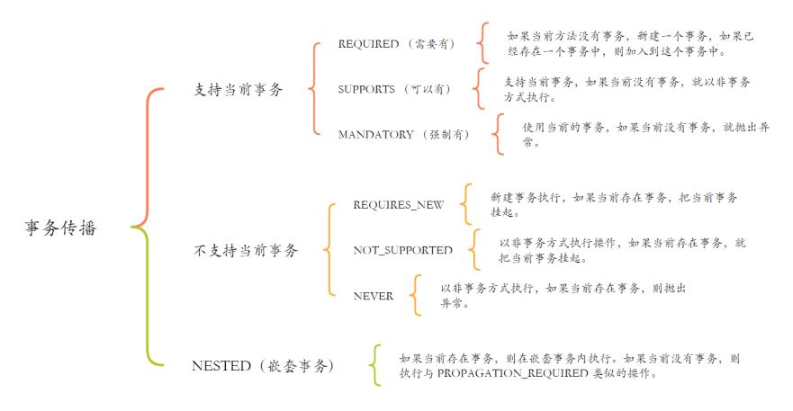

# Spring事务传播机制



```java

public enum Propagation {
    REQUIRED(0),
    SUPPORTS(1),
    MANDATORY(2),
    REQUIRES_NEW(3),
    NOT_SUPPORTED(4),
    NEVER(5),
    NESTED(6);
}

```
## Part 1, 声明式事务
[Spring事务传播机制--包含用例解释](https://blog.csdn.net/qq_45646289/article/details/124882146?spm=1001.2101.3001.6650.7&utm_medium=distribute.pc_relevant.none-task-blog-2%7Edefault%7EBlogCommendFromBaidu%7ERate-7-124882146-blog-129339532.235%5Ev32%5Epc_relevant_default_base3&depth_1-utm_source=distribute.pc_relevant.none-task-blog-2%7Edefault%7EBlogCommendFromBaidu%7ERate-7-124882146-blog-129339532.235%5Ev32%5Epc_relevant_default_base3&utm_relevant_index=11)

## Part 2, 编程式事务
[SpringBoot基础之声明式事务和切面事务和编程式事务](https://blog.csdn.net/qq_41810415/article/details/128178595)

## Part 3, 事务失效

1. 访问权限问题 事务方法访问修饰符非public，导致事务失效
2. 方法用final修饰
3. 方法内部调用 方法自身（this）调用问题，导致事务失效
4. 未被spring管理
5. 多线程调用 __（我们说的同一事务，其实是指同一数据库连接）__
6. 表不支持事务
7. 未开启事务
1. 错误的传播特性
2. 自己吞了异常
3. 手动抛了别的异常
4. 自定义了回滚异常
5. 嵌套事务回滚多了

## Part 4, 其他
### 大事务问题

1. 少用@Transactional注解
2. 将查询(select)方法放到事务外
2. 事务中避免远程调用
2. 事务中避免一次性处理太多数据
2. 非事务执行
2. 异步处理

[让人头痛的大事务问题到底要如何解决？](https://mp.weixin.qq.com/s?__biz=MzkwNjMwMTgzMQ==&mid=2247490259&idx=1&sn=1dd11c5f49103ca303a61fc82ce406e0&source=41#wechat_redirect)

## FYI

[springboot整合jpa，步骤详细（图文结合讲解）](https://blog.csdn.net/web18484626332/article/details/125244121)

[Spring事务传播机制--包含用例解释](https://blog.csdn.net/qq_45646289/article/details/124882146?spm=1001.2101.3001.6650.7&utm_medium=distribute.pc_relevant.none-task-blog-2%7Edefault%7EBlogCommendFromBaidu%7ERate-7-124882146-blog-129339532.235%5Ev32%5Epc_relevant_default_base3&depth_1-utm_source=distribute.pc_relevant.none-task-blog-2%7Edefault%7EBlogCommendFromBaidu%7ERate-7-124882146-blog-129339532.235%5Ev32%5Epc_relevant_default_base3&utm_relevant_index=11)

[spring事务传播机制](https://blog.csdn.net/weixin_43637718/article/details/129339532?spm=1001.2101.3001.6650.3&utm_medium=distribute.pc_relevant.none-task-blog-2%7Edefault%7EYuanLiJiHua%7EPosition-3-129339532-blog-119110150.235%5Ev32%5Epc_relevant_default_base3&depth_1-utm_source=distribute.pc_relevant.none-task-blog-2%7Edefault%7EYuanLiJiHua%7EPosition-3-129339532-blog-119110150.235%5Ev32%5Epc_relevant_default_base3&utm_relevant_index=6)

[Spring事务失效常见场景](https://blog.csdn.net/qq_16268979/article/details/123707823)

[聊聊spring事务失效的12种场景，太坑了](https://blog.csdn.net/lisu061714112/article/details/120098743?spm=1001.2101.3001.6650.1&utm_medium=distribute.pc_relevant.none-task-blog-2%7Edefault%7ECTRLIST%7ERate-1-120098743-blog-123707823.235%5Ev32%5Epc_relevant_default_base3&depth_1-utm_source=distribute.pc_relevant.none-task-blog-2%7Edefault%7ECTRLIST%7ERate-1-120098743-blog-123707823.235%5Ev32%5Epc_relevant_default_base3&utm_relevant_index=2)

[MD基础语法总结](https://www.cnblogs.com/miangao/p/13496753.html)